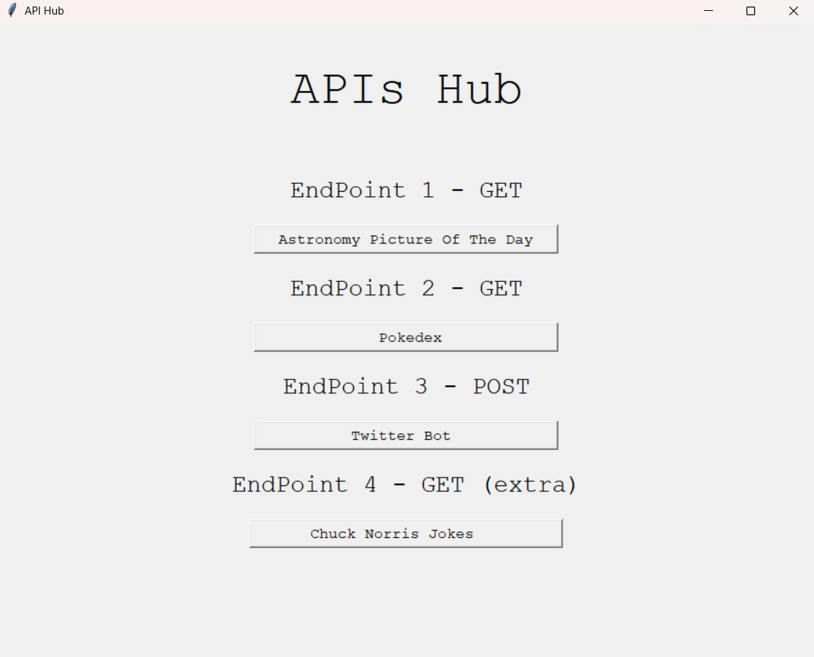
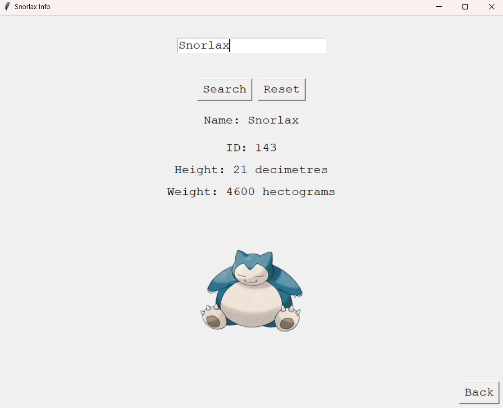
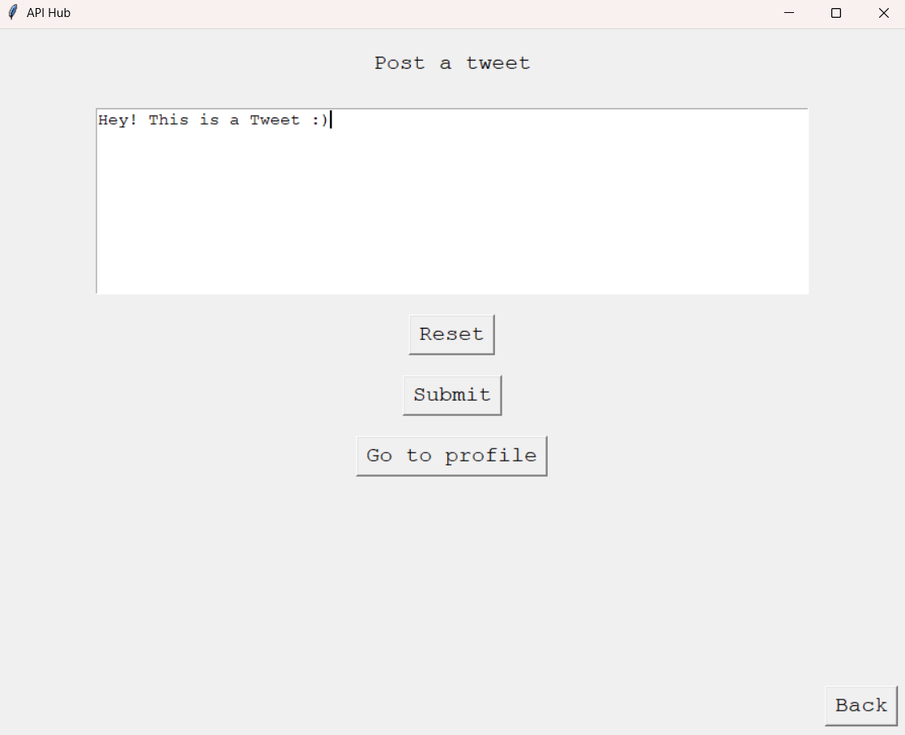
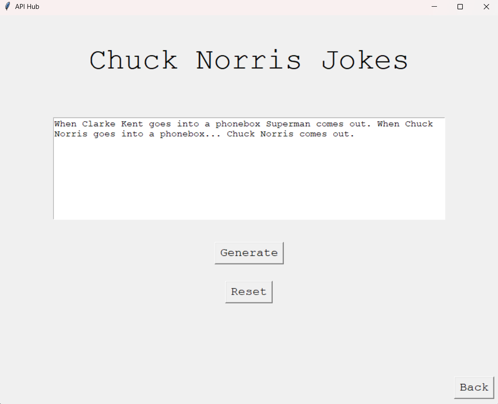

<div align="center">

# 🌐 API Hub

---
## >_ About The Project

**API Hub** is a desktop application that demonstrates the integration of multiple public APIs in a single, user-friendly interface. Built with Python and Tkinter, it showcases both GET and POST HTTP request methods.

---

## >_ Features
<div align="center">
<table>
<tr>
<td width="50%">

### 🔭 NASA APOD

- Browse Astronomy Picture of the Day
- Search by specific date
- View high-quality space images
- Read detailed explanations

</td>
<td width="50%">

### 🐦‍🔥 Pokédex

- Search any Pokémon by name
- View official artwork
- Display stats (height, weight, ID)
- Clean, intuitive interface

</td>
</tr>
<tr>
<td width="50%">

### 🐦 X (Twitter) Bot

- Post tweets directly from the app
- Character limit validation (280 chars)
- Quick profile access
- Real-time posting

</td>
<td width="50%">

### 🤠 Chuck Norris Jokes

- Random joke generator
- Instant joke display
- Family-friendly content
- One-click generation

</td>
</tr>
</table>
</div>

---

## >_ Demo

<div align="center">

### Main Menu

|                Main Hub                 |
| :-------------------------------------: |
|  |

### API Endpoints

|               NASA APOD                |               Pokédex               |
| :------------------------------------: | :---------------------------------: |
|  |  |

|             X (Twitter) Bot             |           Chuck Norris Jokes           |
| :-------------------------------------: | :------------------------------------: |
|  |  |

</div>

---

## >_ Environment Setup

Create a `.env` file in the root directory:

```env
# NASA API
NASA_API_KEY=your_nasa_api_key

# X (Twitter) API
X_CONSUMER_KEY=your_consumer_key
X_CONSUMER_SECRET=your_consumer_secret
X_BEARER_TOKEN=your_bearer_token
X_ACCESS_TOKEN=your_access_token
X_ACCESS_TOKEN_SECRET=your_access_token_secret
```

### Getting API Keys

| API          | Get Key                                                 |
| ------------ | ------------------------------------------------------- |
| NASA         | [api.nasa.gov](https://api.nasa.gov/) (Free)            |
| X (Twitter)  | [developer.twitter.com](https://developer.twitter.com/) |
| Pokémon      | No key required                                         |
| Chuck Norris | No key required                                         |

---

## >_ APIs Used

<div align="center">

|                                                  API                                                   | Type | Endpoint                      | Auth Required |
| :----------------------------------------------------------------------------------------------------: | :--: | :---------------------------- | :-----------: |
|           | GET  | `api.nasa.gov/planetary/apod` |  ✅ API Key   |
|  | GET  | `pokeapi.co/api/v2`           |      ❌       |
|                | POST | `api.twitter.com/2/tweets`    |   ✅ OAuth    |
|                            | GET  | `api.chucknorris.io/jokes`    |      ❌       |

</div>

---

## >_ Project Structure

```
api-hub/
│
├── 📄 API_Hub.py          # Main application
├── 📄 .env                # Environment variables (git ignored)
├── 📄 .env.example        # Environment template
├── 📄 .gitignore          # Git ignore rules
├── 📄 requirements.txt    # Python dependencies
├── 📄 README.md           # Documentation
├── 📄 LICENSE             # MIT License
│
└── 📂 screenshots/        # Demo screenshots
    ├── main_menu.png
    ├── nasa_apod.png
    ├── pokedex.png
    ├── twitter_bot.png
    └── chuck_norris.png
```

---

## >_ License

This project is licensed under the MIT License - see the [LICENSE](LICENSE) file for details.

---

## >_ Author

<div align="center">

**César Malanco**

[](https://github.com/cesarMalanco)

---

<sub>Built with ☕ using Python and Tkinter</sub>

</div>
